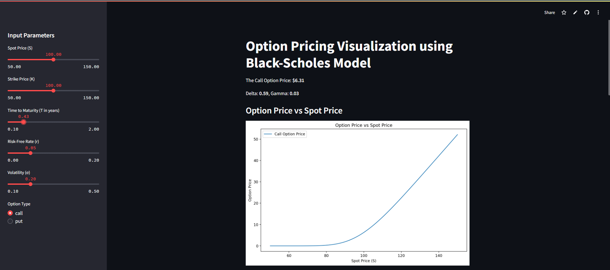
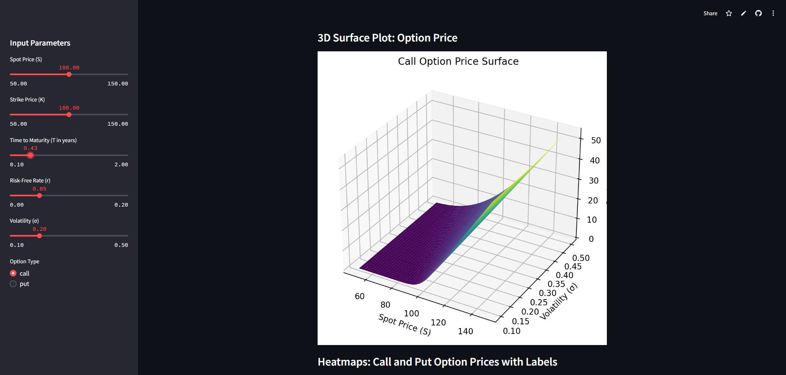
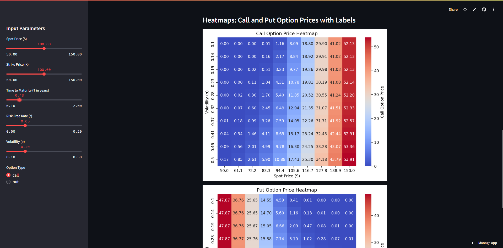

Option Pricing Visualization App
This app uses the Black-Scholes model to visualize option prices and sensitivities (Greeks) through interactive heatmaps. It allows users to explore how call and put option prices change with varying spot prices and volatilities.

Use the following link to access the app :- https://bsoptionpricing.streamlit.app/

Features
Call & Put Option Price Heatmaps: Visualizes how option prices change with respect to spot price and volatility.
Greeks Visualization: Allows users to explore how Greeks (Delta, Gamma, Theta, Vega) vary with option parameters.
Interactive Interface: Built using Streamlit for an easy-to-use web interface.
Installation
Clone the repository and install the required dependencies:

bash
Copy code
git clone https://github.com/leeladhar04/optionPricing_BS_Model.git
cd optionPricing_BS_Model
pip install -r requirements.txt
Usage
To launch the app:

bash
Copy code
streamlit run main.py
The app will open in your browser, allowing you to interact with the heatmaps and visualizations.

Requirements
Streamlit >= 1.25.0
NumPy >= 1.21.0
Matplotlib >= 3.4.0
Seaborn >= 0.11.0
Example Output
Here’s a sample images of the app :

